# 🚀 iServe-U Marketplace

<p align="center">
  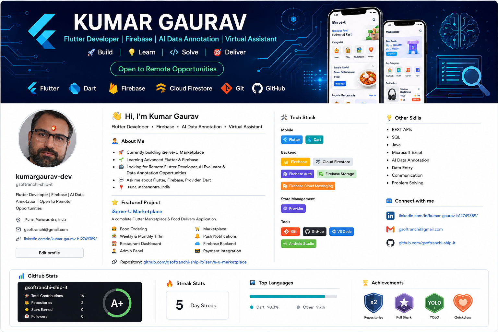
</p>
<p align="center">


</p>

A Flutter Marketplace, Food Delivery & Restaurant Management Platform powered by Firebase.

---

## 📱 Project Overview

iServe-U Marketplace is a cross-platform Flutter application built with Flutter and Firebase.

### Core Modules

- Food Ordering
- Marketplace
- Weekly & Monthly Tiffin
- Restaurant Dashboard
- Admin Dashboard
- Partner Module
- Push Notifications

---

## ✨ Features

### Customer
- Food Ordering
- Marketplace Shopping
- Cart
- Delivery Address
- Notifications

### Restaurant
- Dashboard
- Menu Management
- Product Upload
- Orders

### Admin
- Restaurant Approval
- Order Monitoring
- Sales Reports

---

## 🛠 Tech Stack

| Technology | Purpose |
|------------|---------|
| Flutter | Cross-platform |
| Dart | Programming |
| Firebase Authentication | Login |
| Cloud Firestore | Database |
| Firebase Storage | Images |
| Firebase Cloud Messaging | Notifications |
| Provider | State Management |

---

# 📱 Application Screenshots

## 🔐 Authentication

| Login Screen | Location Selection |
|--------------|--------------------|
| 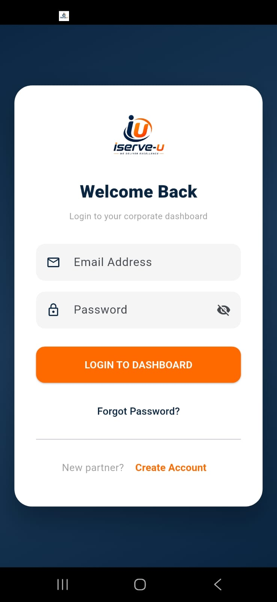 | 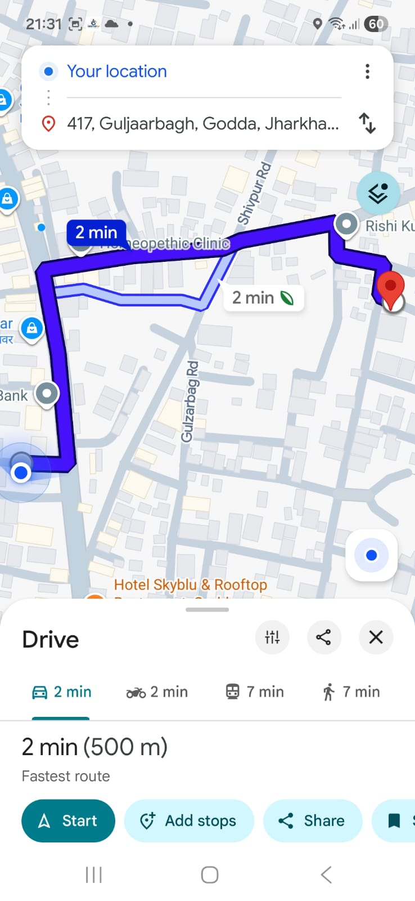 |

---

## 🏠 Customer Application

| Home | Food |
|------|------|
| 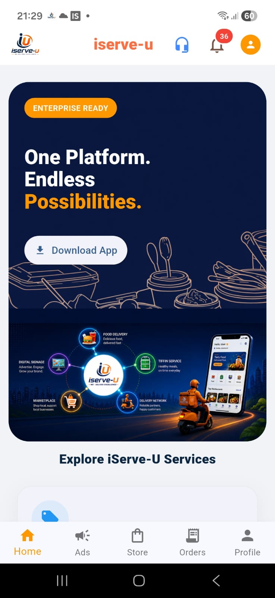 | 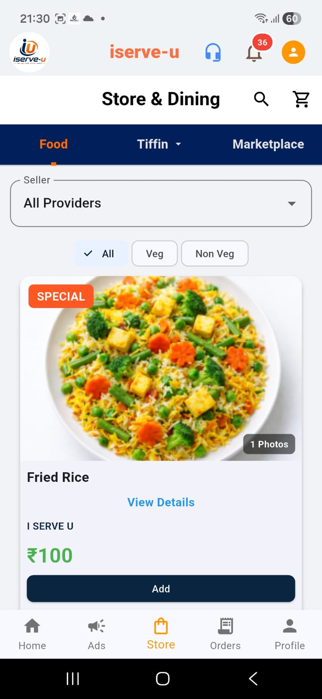 |

| Home (Alternative View) | Cart |
|-------------------------|------|
| 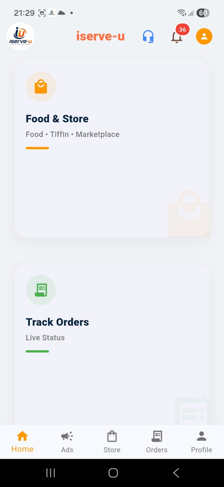 | 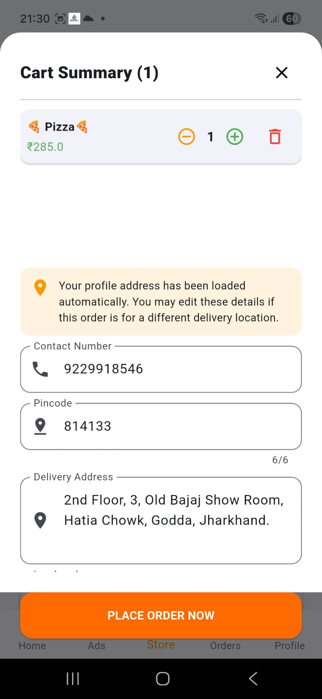 |

---

## 🛍 Marketplace & Orders

| Orders | Notifications |
|--------|---------------|
| 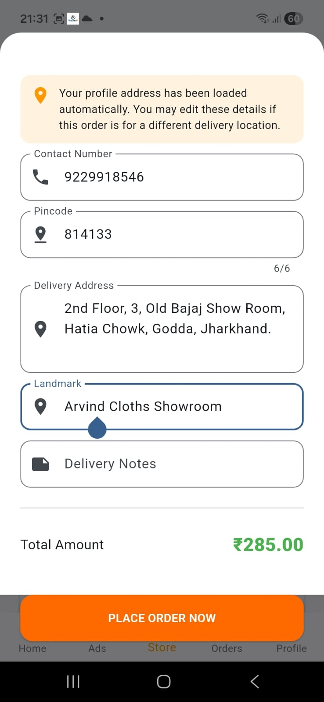 | 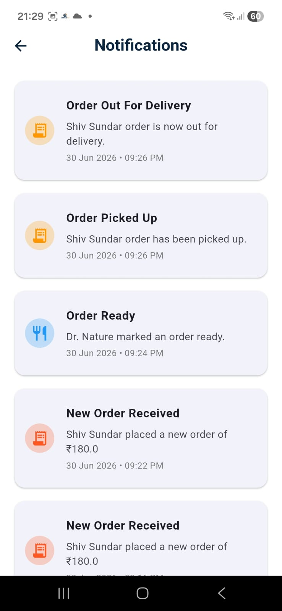 |

---

## 🍽 Restaurant Dashboard

| Dashboard | Add Product |
|-----------|-------------|
| 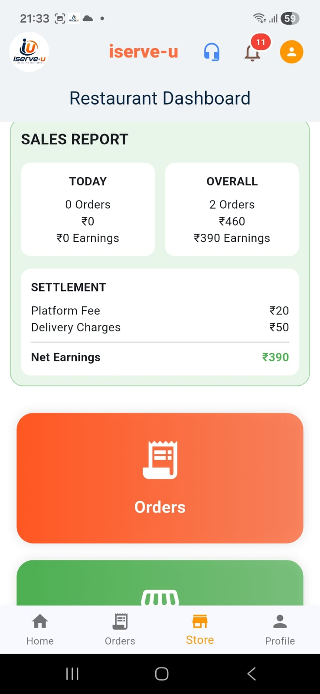 | 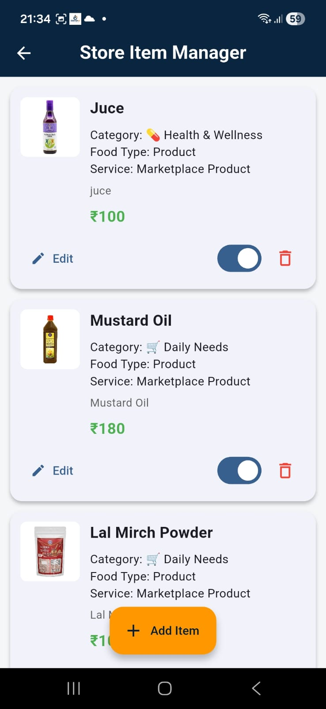 |

---

## 👨‍💼 Admin Dashboard

| Sales Report | Order Assignment |
|-------------|------------------|
| 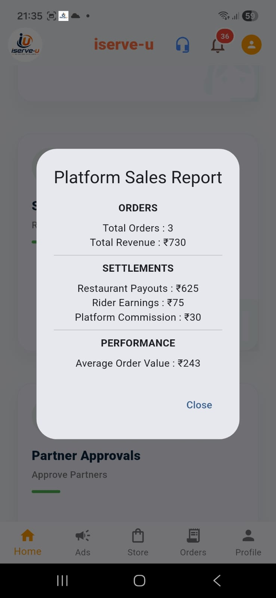 | 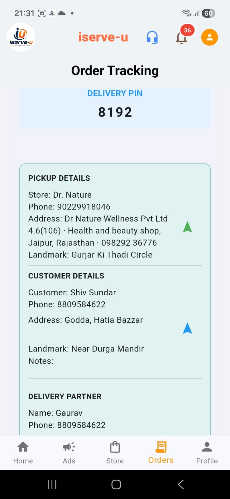 |

---
---


i# 🏗️ System Modules

```text

iServe-U Platform
│
├── 🔐 Authentication
├── 🛒 Marketplace
├── 🍔 Food Ordering
├── 📦 Weekly & Monthly Tiffin
├── 🍽 Restaurant Dashboard
├── 🤝 Partner Module
├── 👨‍💼 Admin Dashboard
├── 🔔 Notifications
├── 📢 Advertisement System
├── 👤 Customer Profile
├── 🛠 Support Center
└── 📊 Analytics
```
# 📂 Project Structure

```text

lib
│
├── core
│   ├── cache
│   ├── models
│   ├── services
│   ├── utils
│   └── widgets
│
├── data
│
├── features
│   ├── food
│   ├── notifications
│   ├── partner
│   ├── profile
│   ├── restaurant
│   └── support
│
├── players
│   ├── android_player
│   ├── web_player
│   └── shared
│
├── screens
│   ├── admin
│   ├── auth
│   ├── food_dining
│   ├── marketplace
│   ├── home
│   ├── profile
│   └── placeholders
│
├── shared_widgets
│
├── firebase_options.dart
└── main.dart
```


## ☁️ Firebase

- Firebase Authentication
- Cloud Firestore
- Firebase Storage
- Firebase Cloud Messaging
- Firebase Hosting (Web)
- Firebase Analytics Ready

---

## 🚀 Installation

```bash
git clone https://github.com/gsoftranchi-ship-it/iserve-u-marketplace.git
cd iserve-u-marketplace
flutter pub get
flutter run
```

## 📊 Project Statistics

- ✅ 50+ Flutter Screens
- ✅ 25+ Firebase Collections
- ✅ Customer Application
- ✅ Restaurant Panel
- ✅ Admin Dashboard
- ✅ Partner Module
- ✅ Advertisement System
- ✅ Push Notifications
- ✅ Cross Platform Support

---
## 📱 Supported Platforms

✅ Android

✅ Web

✅ Windows

🚧 iOS (Coming Soon)


---
##  Architecture
Flutter App

↓

Firebase Authentication

↓

Cloud Firestore

↓

Firebase Storage

↓

Firebase Cloud Messaging

## 🔮 Future Roadmap

- Live Order Tracking

- Wallet Integration

- Coupons & Offers

- Customer Ratings

- Multi-language

- Business Analytics

- AI Recommendation Engine

- Dark Theme

---

## License

MIT License

---

## 👨‍💻 Developer

**Kumar Gaurav**

GitHub: https://github.com/gsoftranchi-ship-it

LinkedIn: https://www.linkedin.com/in/kumar-gaurav-b12749389/

Email: gsoftranchi@gmail.com

---

⭐ If you found this project useful, please give it a star.
